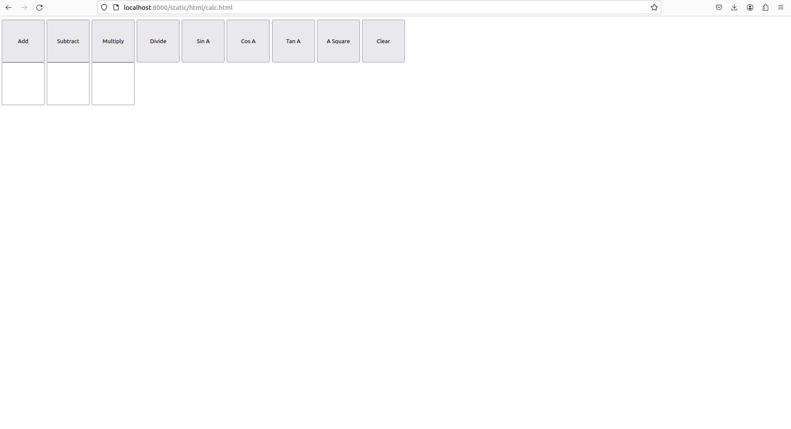

# Design of a Standard Calculator

## AIM:

To design a web application for a standard calculator.

## DESIGN STEPS:

### Step 1:
 Fork the github repository at https://github.com/gowriganeshns/standard-calculator

### Step 2:
 cd standard-calculator and then create a django project by typing:

 django-admin startproject myproj

### Step 3:
 go to settings.py under myproj/myproj and make the following changes

 1) in line 14, add import os

 2) under ALLOWED_HOSTS, include '*' in the list.

 3) at the end, in line 121, add the following code:
    
    STATICFILES_DIRS = [
        os.path.join(BASE_DIR,'static')
    ]

### Step 4:
 Now that we have made the changes, type the following commands to create a folder static, and then another folder html in it.

 (from standard-calculator/myproj)

 mkdir static
 cd static
 mkdir html
 cd html

### Step 5:
 Now that we have made the changes, type the following commands to create a folder static, and then another folder html in it.

 (from standard-calculator/myproj)

 mkdir static
 cd static
 mkdir html
 cd html
### Step 6:

Validate the HTML and CSS code.

### Step 6:

Publish the website in the given URL.

## PROGRAM :
<html>
<head>

</head>
<body>
<form>
<input type="button" style="height: 100px; width: 100px;" onclick="f1()" value="Add">
<input type="button" style="height: 100px; width: 100px;" onclick="f2()" value="Subtract">
<input type="button" style="height: 100px; width: 100px;" onclick="f3()" value="Multiply">
<input type="button" style="height: 100px; width: 100px;" onclick="f4()" value="Divide">
<input type="button" style="height: 100px; width: 100px;" onclick="f5()" value="Sin A">
<input type="button" style="height: 100px; width: 100px;" onclick="f6()" value="Cos A">
<input type="button" style="height: 100px; width: 100px;" onclick="f7()" value="Tan A">
<input type="button" style="height: 100px; width: 100px;" onclick="f8()" value="A Square">
<input type="button" style="height: 100px; width: 100px;" onclick="f9()" value="Clear">
 
<input type="text" style="height: 100px; width: 100px;" id="n1">
<input type="text" style="height: 100px; width: 100px;" id="n2">
<input type="text" style="height: 100px; width: 100px;" id="n3">
</form>
</body>
</html>
## OUTPUT:

## Result:
 We have now succesfully created a standard calculator

